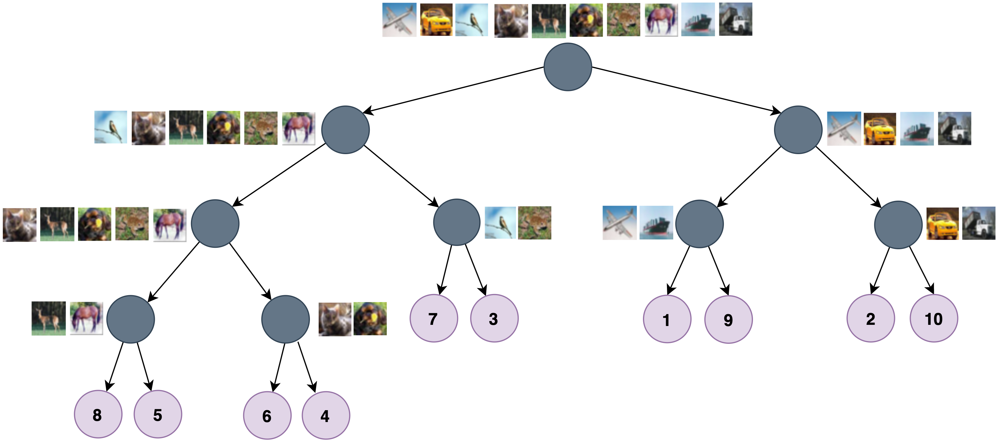

# GP-Tree: A Gaussian Process Classifier for Few-Shot Incremental Learning
<p align="center"> 
    
</p>
Gaussian processes (GPs) are non-parametric, flexible, models that work well in many tasks. Combining GPs with deep learning methods via deep kernel learning (DKL) is especially compelling due to the strong representational power induced by the network. However, inference in GPs, whether with or without DKL, can be computationally challenging on large datasets. For this purpose, we proposed GP-Tree, a novel method for multi-class classification with Gaussian processes and DKL. We developed a tree-based hierarchical model in which each internal node of the tree fits a GP to the data using the Pólya-Gamma augmentation scheme. As a result, our method scales well with both the number of classes and data size. We demonstrated our method effectiveness against other Gaussian process training baselines, and we showed how our general GP approach is easily applied to incremental few-shot learning and achieves state-of-the-art performance.

[[Paper]](https://arxiv.org/abs/2102.07868)

### Instructions
install this repo via
```bash
git clone https://github.com/IdanAchituve/GP-Tree.git
pip install -e .
```

### Download data:
1. Download the data:  
    a. CUB-200-2011 is available for download through: http://www.vision.caltech.edu/datasets/  
    b. mini-ImageNet can be obtained at: https://drive.google.com/u/0/uc?id=0B3Irx3uQNoBMQ1FlNXJsZUdYWEE
2. Place the data under ./FSCIL/xxx/dataset, where xxx is either cub or miniImageNet.

### Run code:
```bash
cd FSCIL
python trainer.py
```

### Citation
Please cite our paper if you want to use it in your work,
```
@InProceedings{achituve2021gp_icml,
  title = {{GP}-{T}ree: A {G}aussian Process Classifier for Few-Shot Incremental Learning},
  author = {Achituve, Idan and Navon, Aviv and Yemini, Yochai and Chechik, Gal and Fetaya, Ethan},
  booktitle = {Proceedings of the 38th International Conference on Machine Learning},
  pages = {54--65},
  year = {2021},
  publisher = {PMLR},
}
```
